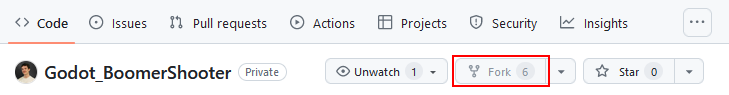
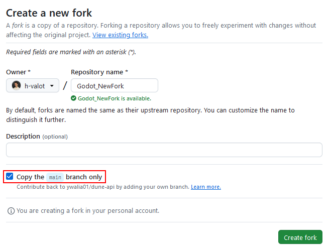

# Table of contents
1. [Compatibles version of Godot](#compatibles-version-of-godot)
2. [Instructions](#instructions)
	1. [How to fork the toolkit](#how-to-fork-the-toolkit)
	2. [How to update your toolkit](#how-to-update-your-toolkit)
	3. [How to use the toolkit](#how-to-use-the-toolkit)
3. [Development status](#development-status)
	1. [Character](#character)
	2. [Tools](#tools)
	3. [Gameplay systems](#gameplay-systems)
	4. [Interactibles](#interactibles)
	5. [Miscs](#miscs)

# Compatibles version of Godot
Those both version of Godot are fully compatible with the toolkit.

- [Godot v4.2.1](https://godotengine.org/download/archive/4.2.1-stable/)
- [Godot v4.2.2](https://godotengine.org/download/archive/4.2.2-stable/)

# Instructions

## How to fork the toolkit 

1. On this github page, click "Fork"

2. On the newly opened page, rename to match your project name
3. Check "Copy the `main` branch only".
4. Click "Create fork"

## How to update your toolkit

**[Here](https://www.notion.so/onahime/How-to-update-your-forked-project-10e46d9f40dc4588a72b9051043230e8)** is the corresponding documentation.

## How to use the toolkit

**[Here](https://onahime.notion.site/Boomer-Shooter-documentation-481e9d32d3d349889b5d19d746b3eb8a?pvs=4)** is the documentation of the toolkit.

The [Custom](/Custom/) folder is your workspace. **Everything you do must be in there. DO NOT MODIFY FILES FROM [ASSETS](../Assets/) FOLDER ON YOUR OWN.** If you don't, we will not be responsible for any potential problems.

# Development status
Find more details about the development status on the online documentation. 

## Character
- [x] 'Quake-like' FPS Controller
- [x] Basic Combat AI  (melee & distance)

## Tools
- [x] Opponent creation tool
- [x] Items creation tool
- [ ] Sound, music & sfx implementation tools

## Gameplay systems
- [x] Dialogues
- [ ] Quests
- [x] Inventory

## Interactibles
- [x] Doors
- [ ] Chests
- [x] Pickups

## Miscs
- [ ] Soulslike checkpoint system
- [ ] Scene management
